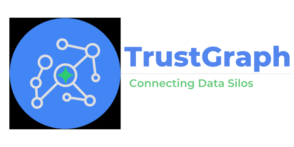
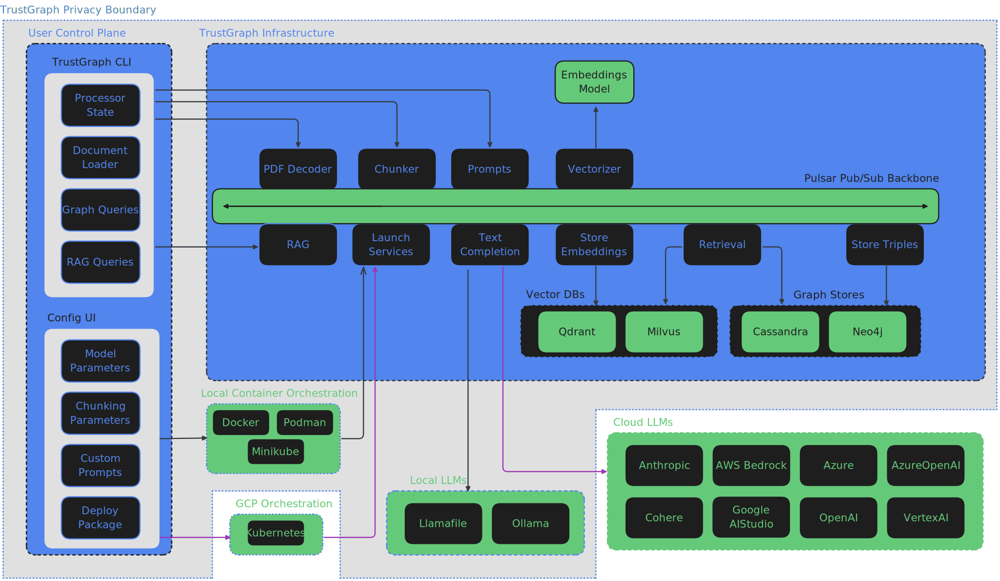

<div align="center">



## Connect Data Silos with Reliable AI

</div>

<div align="center">

[](https://pypi.org/project/trustgraph/) [](https://discord.gg/sQMwkRz5GX)

🚀 [Get Started](https://trustgraph.ai/docs/getstarted) 🧑‍💻 [CLI Docs](https://trustgraph.ai/docs/running/cli) 📋 [Use Cases](https://trustgraph.ai/docs/usecases) 💬 [Join the Discord](https://discord.gg/sQMwkRz5GX) 📺 [YouTube](https://www.youtube.com/@TrustGraph?sub_confirmation=1) 📖 [Blog](https://blog.trustgraph.ai)

</div>

TrustGraph is a full AI powered data engineering platform. Extract your documents to knowledge graphs and vector embeddings with customizable data extraction agents. Deploy AI agents that leverage your data to generate reliable and accurate AI responses.

## Key Features

- 📄 **Document Extraction**: Bulk ingest documents such as `.pdf`,`.txt`, and `.md`
- 🔁 **No-code LLM Integration**: Anthropic, AWS Bedrock, AzureAI, AzureOpenAI, Cohere, Google AI Studio, Google VertexAI, Llamafiles, Ollama, and OpenAI
- 📖 **Entity, Topic, and Relationship Knowledge Graphs**
- 🔢 **Mapped Vector Embeddings**
- ❔**No-code RAG Queries**: Automatically perform a semantic similiarity search and subgraph extraction for the context of LLM generative responses
- 🤖 **AI Agent Generation**: Use AI to generate agent modules that autonomously run on the Apache pub/sub backbone
- 🎛️ **Production-Grade** reliability, scalability, and accuracy
- 🔍 **Observability**: get  insights into system performance with Prometheus and Grafana
- 🗄️ **AI Powered Data Warehouse**: Load only the subgraph and vector embeddings you use most often
- 🪴 **Customizable and Extensible**: Tailor for your data and use cases
- 🖥️ **Configuration UI**: Build the `YAML` configuration with drop down menus and selectable parameters

## Get Started

There are two primary ways of interacting with TrustGraph:

- TrustGraph CLI
- Configuration UI

The `TrustGraph CLI` installs the commands for interacting with TrustGraph while running. The `Configuration UI` enables customization of TrustGraph deployments prior to launching.

### Install the TrustGraph CLI

```
pip3 install trustgraph-cli==0.14.15
```

> [!NOTE]
> The `TrustGraph CLI` version must match the desired `TrustGraph` release version.

### Configuration UI

While TrustGraph is endlessly customizable through the `YAML` launch files, the `Configuration UI` can build a custom configuration in seconds that deploys with Docker, Podman, Minikube, or Google Cloud.

[Configuration UI 🚀](https://config-ui.demo.trustgraph.ai/)

https://github.com/user-attachments/assets/90eeaea6-82b7-480a-9972-edb66ea99738

Launch Steps:

- For the selected `Model Deployment`, follow the instructions in `Model credentials` section to configure any required environment variables or paths
- Fill in the desired LLM name in the `Model Name` field that corresponds to your selected `Model Deployment`
- Set all desired `Model Parameters`
- Click `GENERATE` under the `Deployment configuration` section
- Follow the instructions under `Launch`

Once `deploy.zip` has been unzipped, launching TrustGraph is as simple as navigating to the `deploy` directory and running:
```
docker compose up -d
```

When finished, shutting down TrustGraph is as simple as:
```
docker compose down -v
```

## TrustGraph Releases

TrustGraph releases are available [here](https://github.com/trustgraph-ai/trustgraph/releases). Download `deploy.zip` for the desired release version.

| Release Type | Release Version |
| ------------ | --------------- |
| Latest | [0.15.1](https://github.com/trustgraph-ai/trustgraph/releases/download/v0.15.1/deploy.zip) |
| Stable | [0.14.15](https://github.com/trustgraph-ai/trustgraph/releases/download/v0.14.15/deploy.zip) |

TrustGraph is fully containerized and is launched with a `YAML` configuration file. Unzipping the `deploy.zip` will add the `deploy` directory with the following subdirectories:

- `docker-compose`
- `minikube-k8s`
- `gcp-k8s`

Each directory contains the pre-built `YAML` configuration files needed to launch TrustGraph:

| Model Deployment | Graph Store | Launch File |
| ---------------- | ------------ | ----------- |
| AWS Bedrock API | Cassandra | `tg-bedrock-cassandra.yaml` |
| AWS Bedrock API | Neo4j | `tg-bedrock-neo4j.yaml` |
| AzureAI API | Cassandra | `tg-azure-cassandra.yaml` |
| AzureAI API | Neo4j | `tg-azure-neo4j.yaml` |
| AzureOpenAI API | Cassandra | `tg-azure-openai-cassandra.yaml` |
| AzureOpenAI API | Neo4j | `tg-azure-openai-neo4j.yaml` |
| Anthropic API | Cassandra | `tg-claude-cassandra.yaml` |
| Anthropic API | Neo4j | `tg-claude-neo4j.yaml` |
| Cohere API | Cassandra | `tg-cohere-cassandra.yaml` |
| Cohere API | Neo4j | `tg-cohere-neo4j.yaml` |
| Google AI Studio API | Cassandra | `tg-googleaistudio-cassandra.yaml` |
| Google AI Studio API | Neo4j | `tg-googleaistudio-neo4j.yaml` |
| Llamafile API | Cassandra | `tg-llamafile-cassandra.yaml` |
| Llamafile API | Neo4j | `tg-llamafile-neo4j.yaml` |
| Ollama API | Cassandra | `tg-ollama-cassandra.yaml` |
| Ollama API | Neo4j | `tg-ollama-neo4j.yaml` |
| OpenAI API | Cassandra | `tg-openai-cassandra.yaml` |
| OpenAI API | Neo4j | `tg-openai-neo4j.yaml` |
| VertexAI API | Cassandra | `tg-vertexai-cassandra.yaml` |
| VertexAI API | Neo4j | `tg-vertexai-neo4j.yaml` |

Once a configuration `launch file` has been selected, deploy TrustGraph with:

**Docker**:
```
docker compose -f <launch-file.yaml> up -d
```

**Kubernetes**:
```
kubectl apply -f <launch-file.yaml>
```

## Architecture



TrustGraph is designed to be modular to support as many LLMs and environments as possible. A natural fit for a modular architecture is to decompose functions into a set of modules connected through a pub/sub backbone. [Apache Pulsar](https://github.com/apache/pulsar/) serves as this pub/sub backbone. Pulsar acts as the data broker managing data processing queues connected to procesing modules.

### Pulsar Workflows

- For processing flows, Pulsar accepts the output of a processing module and queues it for input to the next subscribed module.
- For services such as LLMs and embeddings, Pulsar provides a client/server model.  A Pulsar queue is used as the input to the service.  When processed, the output is then delivered to a separate queue where a client subscriber can request that output.

## Data Extraction Agents

TrustGraph extracts knowledge documents to an ultra-dense knowledge graph using 3 automonous data extraction agents. These agents focus on individual elements needed to build the knowledge graph. The agents are:

- Topic Extraction Agent
- Entity Extraction Agent
- Node Connection Agent

The agent prompts are built through templates, enabling customized extraction agents for a specific use case. The extraction agents are launched automatically with the loader commands.

PDF file:
```
tg-load-pdf <document.pdf>
```

Text or Markdown file:
```
tg-load-text <document.txt>
```

## RAG Queries

Once the knowledge graph and embeddings have been built or a knowledge core has been loaded, RAG queries are launched with a single line:

```
tg-query-graph-rag -q "Write a blog post about the 5 key takeaways from SB1047 and how they will impact AI development."
```

## Deploy and Manage TrustGraph

[🚀 Full Deployment Guide 🚀](https://trustgraph.ai/docs/getstarted)

## TrustGraph Developer's Guide

[Developing for TrustGraph](docs/README.development.md)
